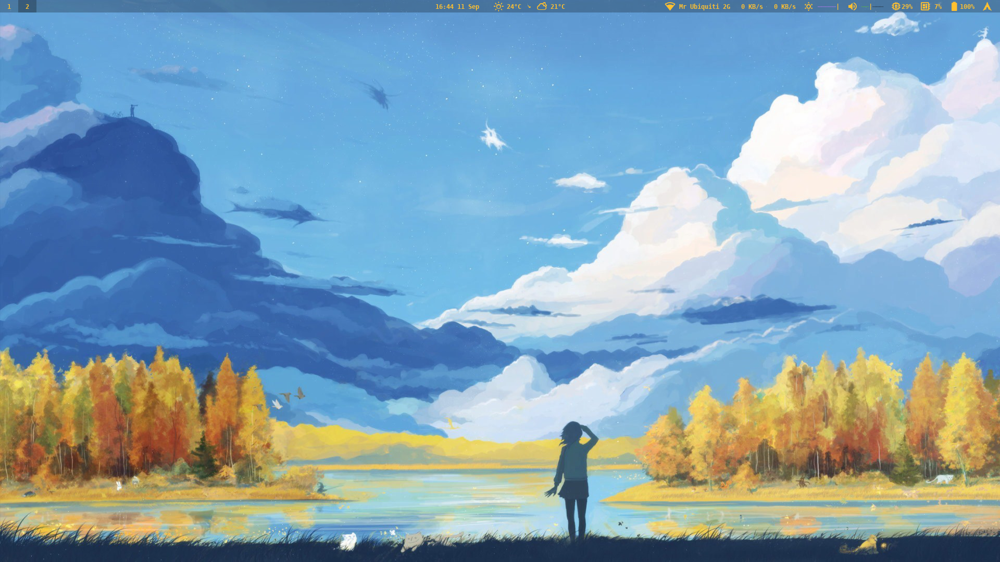
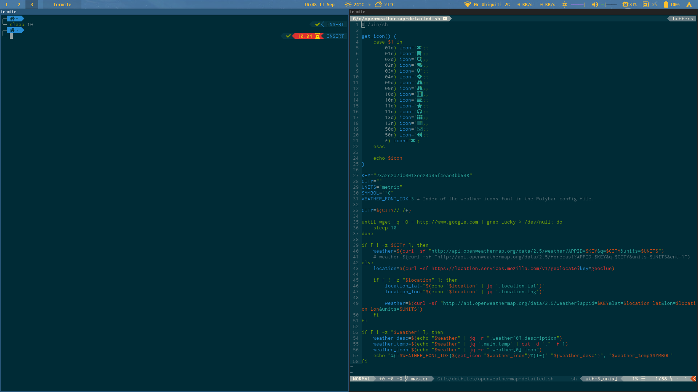

# JL Dotfiles
A repo containing my dotfiles.

## Screenshots



## Requisite Packages
* General
    * `yay -S zsh zplug thefuck exa fasd fzf yapf the_silver_searcher rofi termite neovim i3 polybar rofi`
* fonts
    * `yay -S ttf-dejavu nerd-fonts-complete ttf-material-design-icons-git ttf-weather-icons`
* neovim
    * `pip2 install neovim`
    * `pip3 install neovim neovim-remote`
    * `vim-plug` (https://github.com/junegunn/vim-plug)

    ```bash
    curl -fLo ~/.vim/autoload/plug.vim --create-dirs \
        https://raw.githubusercontent.com/junegunn/vim-plug/master/plug.vim
    ```
* polybar (weather module)
    * `yay -S jq`
    * OpenWeatherMap-Key (https://openweathermap.org/appid)

## Installation
Dotfiles installed (symlinks created) with
```bash
./make-symlinks.py
```
